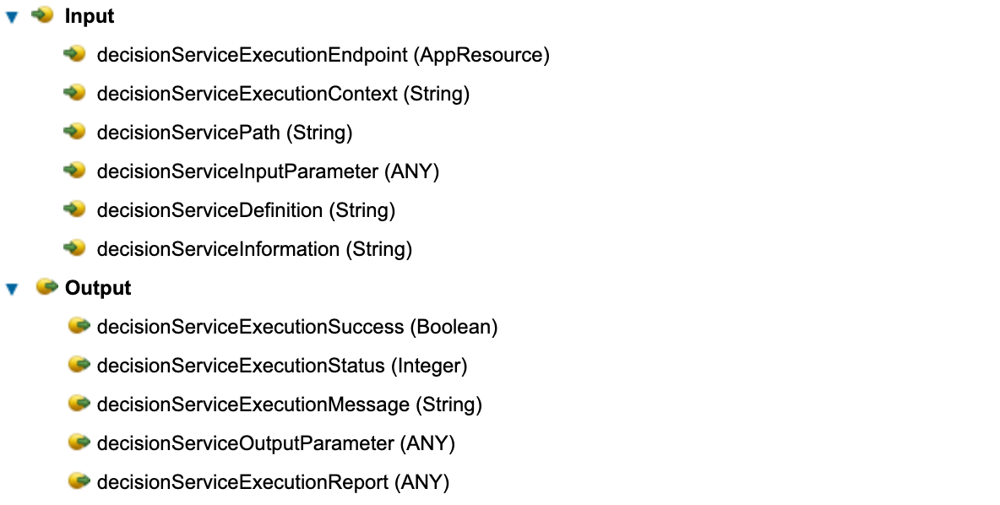

# Decisions Contribution

This contribution allows **App Designer** users to create applications that use *decision services* that are deployed in an **IBM Operational Decision Manager (ODM)** instance.

The contribution consists of the following elements:
- Toolkit: **Decisions**
- Action Configurator: **Execute Decision Service Action Configurator**

> ### Prerequisites
>
> You must have a working instance of ODM that meets the following specifications:
> - Minimum version: 8.9.0
> - Configured so that the hosted transparent decision service web application, and the management REST API that is hosted by the Rule Execution Server console are either unsecured or secured with basic authentication.

## Decisions Toolkit
With this toolkit, users can execute a decision service. The toolkit contains a single action, named **Execute Decision Service**, that is dedicated to this task.
The toolkit is generic and designed so that you can derive a specialized toolkit from it to target the execution of a specific decision.

The **Execute Decision Service** action is defined with the following input and output parameters:

The input parameters represent the mandatory information for running any decision service. They are set at design time when running the **Execute Decision Service Action Configurator** to customize a specific decision service run. They should not be updated manually later on, except for the *DecisionServiceExecutionEndpoint* parameter that contains information about the target ODM server (credentials, in particular).

The output parameters represent the outcome of the decision service execution:

| Variable name                   | Type    | Description  |
|:--------------------------------|:-------:|:-------------|
| decisionServiceExecutionSuccess | Boolean | *true* or *false* whether the execution is successful or not |
| decisionServiceExecutionStatus  | Integer | the HTTP status code of the response to the execution HTTP request |
| decisionServiceExecutionMessage | String  | the error message, when the execution is not successful |
| decisionServiceOutputParameter  | ANY     | the decision service output object, extracted from the response |
| decisionServiceExecutionReport  | ANY     | an object that can used to troubleshoot an unexpected execution behaviour |

## Execute Decision Service Action Configurator
The **Execute Decision Service Action Configurator** is used to define an action that runs a specific *decision service*.

The configurator has a wizard that guides the user through several steps:
- Defining connection parameters that correspond to a *Rule Execution Server console* instance
- Defining connection parameters that correspond to a *Hosted Transparent Decision Service* instance
- Selecting a specific *RuleApp* from a list of available *RuleApps*
- Selecting a specific *ruleset* from a list of available *rulesets* within the selected *RuleApp*
- Selecting whether to use the latest *RuleApp* and/or latest *ruleset* versions during the run, or if the execution precisely targets the selected *RuleApp* and *ruleset* version
- Presenting a summary of the configured decision service execution action

Upon completion, the following changes are performed in the artifact in which the action is defined:
- Business objects corresponding to the decision service model are created.
- The predefined input variables of the action, which corresponds to the base action (**Execute Decision Service**, see the **Decisions Toolkit** section), are populated.
- Additional input and output variables are created, representing the input and output parameters hierarchy of the decision service, based on the created business objects.
- An AppResource element named *DECISIONS_EXECUTION_ENDPOINT* is created. It corresponds to the server that is hosting the targeted *hosted transparent decision service* instance.

## How do you run a decision service from an app?
Follow these steps:
- Deploy the **Decisions Toolkit** and **Execute Decision Service Action Configurator** in your App Designer environment. Otherwise, use the .twx files that are available in this repository.
- Have a working ODM instance that can be reached across the network from the App Designer environment in which you wish to create and run an app that runs a decision service.
- Ensure that the decision service is available from the ODM instance, and that the corresponding ruleset is compliant with OpenAPI. You can check if the OpenAPI definition generates properly for that ruleset.
- Create a toolkit, add a dependency to the **Decisions Toolkit**, and create an action.
- Add a Nested Action node in the diagram of the new action.
- Choose to nest the **Execution Decision Service** action of the **Decisions Toolkit**.
- Click the *Configure* button to launch the **Execute Decision Service Action Configurator**.
- Follow all the steps in the configurator.
- Optional: Create output variables for the global-purpose output elements of the **Execute Decision Service** action (decisionServiceExecutionSuccess, decisionServiceExecutionStatus, decisionServiceExecutionMessage, decisionServiceExecutionReport) if you need to use them in your app. Then, you need to update the *Data Mapping* section of the created action: map the nested action output parameters to the previously created variables.
- Create an app.
- Add a dependency to the previously created toolkit.
- Create variables that correspond to the input and output parameters of the action that is defined in the toolkit.
- Create application logic that populates values or takes user input for the variables that correspond to the input parameters of the action, and that processes or displays the values for the variables that correspond to the output parameters of the action.
- Invoke the action from the app.

> ### Troubleshooting
> To troubleshoot issues with the *Execute Decision Service Action Configurator*, check the entries that start with [ODM Action Configurator] in the log files.
> 
> To troubleshoot issues with the *Decision Service* execution, check the entries that start with [ODM Toolkit] in the log files. You can also expose the *decisionServiceExecutionReport* variable, and then check its content.

> ### Limitations
>
> - 64-bit integers (or "long" numbers) that appear in the *decision service* input parameters hierarchy are defined as regular integers (32 bits) in the corresponding business objects, so their value is limited.
> - 64-bit integers (or "long" numbers) that appear in the *decision service* output parameters hierarchy are defined as regular integers (32 bits) in the corresponding business objects, so the decision service execution might fail if the value cannot be contained in a 32-bit integer.
> - To run a *decision service*, it must be compliant with the OpenAPI constraints in *Rule Execution Server* (see *Operational Decision Manager* documentation)
